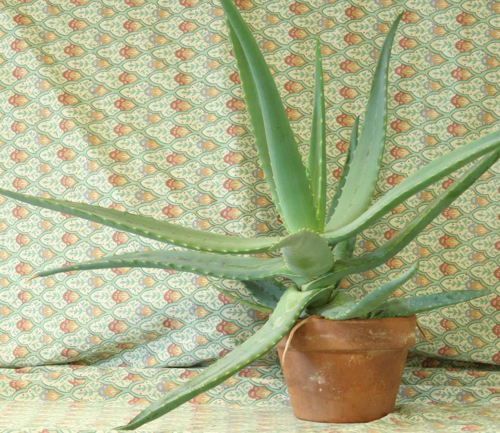
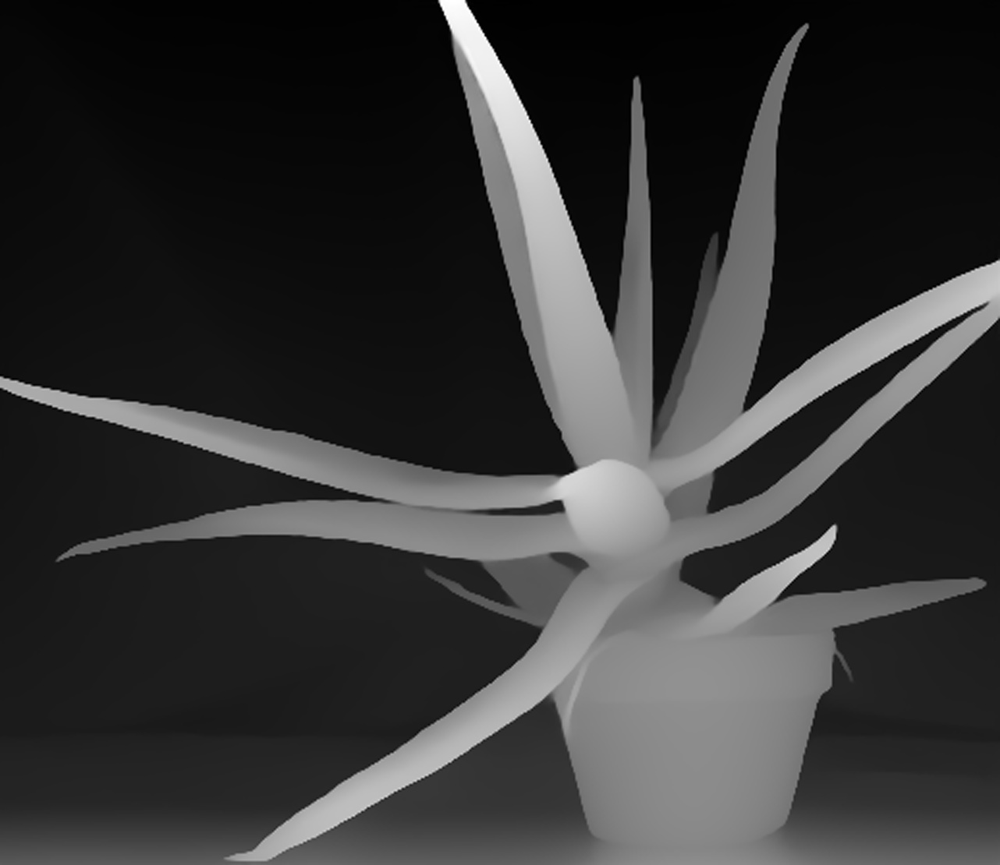

# OpenCV 5.x Depth Anything v2 Large inference example.
An example inference of Depth Anything v2 with OpenCV 5 DNN module.

## Dependencies
To build and run this example, you need the following library and ONNX file.

1. OpenCV 5.x
   - Need to build yourself (Official pre-build version not tested).
   - To use ONNX Runtime backend('cv::dnn::ENGINE_ORT')
     - Enable 'WITH_ONNXRUNTIME' CMake flag.
     - Optionally, enable 'DOWNLOAD_ONNXRUNTIME_GPU' to use GPU (No need to install CUDA).
2. ONNX File
   - Download converted ONNX file from [Here](https://huggingface.co/onnx-community/depth-anything-v2-large).
     - 'onnx/model.onnx' in 'Files and versions'.
     - Quantized models (e.g., FP16/INT8) may not work properly.

## How to build
This project uses CMake for configuration. Follow the steps below.

## Note for Windows and ONNX Runtime users
Windows has a Well-known ONNX Runtime dll problem.  
If it doesn't work, check your DLL Load sequence. You can see like this,  
```
'opencv5_onnx_test.exe'(Win32): 'C:\Windows\System32\onnxruntime.dll'을(를) 로드했습니다. 포함/제외 설정으로 기호 로드가 비활성화되었습니다.
or
'opencv5_onnx_test.exe'(Win32): Loaded 'C:\Windows\System32\onnxruntime.dll'.

```
### Why?
* Windows has a very old onnxruntime.dll in the System32 and 'SysWOW64' directories by default
* your application loads this outdated file
* Microsoft just leaves this issue unresolved.

### Solution?
* Copy downloaded onnxruntime.dll files in '(OpenCV 5.0 Dir)\build\3rdparty\onnxruntime\onnxruntime-win-x64-gpu-1.25.1\lib'   
  to your application's *.exe file location.
* Delete old onnxruntime.dll in 'System32' also 'SysWOW64'.
  * But It's hard because it's system file.

This is a very old Microsoft problem. I don't know why they just leave this shit unresolved.

### Directory Structure Setup
1. Use CMake. 
2. Ensure your project directory is structured as follows

```text
your-project-root/
├── CMakeLists.txt
├── opencv5_onnx_test.cpp
└── test/
    ├── aloeL.jpg         <-- Place your input image here
    └── model.onnx        <-- Place the downloaded ONNX model here
```

### Configure and Build

```bash
# Create a build directory
mkdir build
cd build

# Configure CMake project with OpenCV build path
cmake .. -DOpenCV_DIR="C:/path/to/opencv/build"

# Build the project (For Release mode)
cmake --build . --config Release
```

### Test sample
1. Input image

3. Sample output

